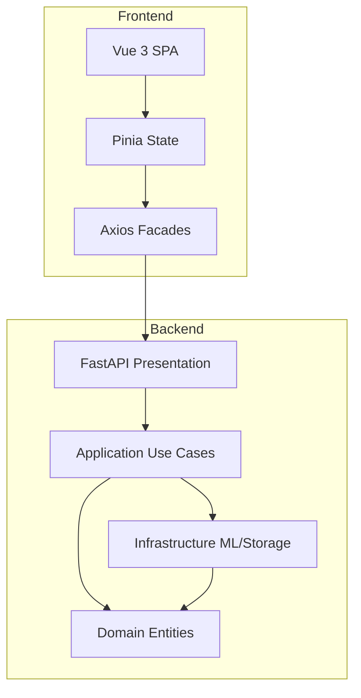

# Enterprise Analytics Platform


## Overview
A production-ready Enterprise Analytics Platform designed to automate data profiling, cleaning, and clustering via Machine Learning. It provides business users with a scalable, automated, and intuitive platform to transform raw CSV datasets into actionable business insights without requiring deep data science expertise.

## Architecture

This project strictly follows **Clean Architecture**:



## Screenshots
<!-- TODO: Replace these placeholders with actual screenshots of the application before publishing -->
### Dashboard


### Data Upload


### Clustering Analysis


## Key Features
- **Automated Data Profiling:** Instant statistical insights (dimensions, types, missing values).
- **Intelligent Data Cleaning:** Automated imputation (median, mode, forward-fill) and duplication handling.
- **Unsupervised ML Clustering:** Seamless k-means clustering with automatic optimal `k` detection (Elbow Method).
- **Interactive Dashboards:** Dynamic Apache ECharts visualizations.
- **Enterprise Hardened:** Strict CORS, CSP, non-root Docker execution, and rate-limiting.

## Tech Stack
- **Frontend:** Vue 3 (Composition API), TypeScript, Tailwind CSS, TanStack Query, Apache ECharts, Playwright.
- **Backend:** FastAPI, Pydantic, Scikit-learn, Pandas, NumPy, Uvicorn.
- **DevOps:** Docker, GitHub Actions, Vercel, Hugging Face Spaces.

## Project Structure
```text
.
├── .github/          # GitHub Actions, Issue Templates, Dependabot
├── assets/           # Static assets for documentation
├── backend/          # FastAPI Python Backend (Clean Architecture)
├── docker/           # Dockerfiles for multi-stage builds
├── docs/             # Comprehensive technical documentation
├── frontend/         # Vue 3 SPA Frontend
└── scripts/          # Helper scripts (deployment, reports)
```

## Quick Start

### Prerequisites
- Node.js (v20+)
- Python (3.12+)
- Poetry (`pip install poetry`)
- Docker & Docker Compose

### Run via Docker
```bash
docker-compose up --build
```
The frontend will be available at `http://localhost:5173` and the backend API at `http://localhost:8000`.

## Deployment
See the [Deployment Guide](docs/deployment.md) for full instructions on deploying to **Vercel** (Frontend) and **Hugging Face Spaces** (Backend).

## Testing & Quality Gates
The platform enforces strict quality gates:
- **Frontend:** ESLint, TypeScript Typecheck, Vitest, Playwright E2E.
- **Backend:** Ruff, MyPy, Pytest (Coverage > 85%).
Detailed reports are available in the [Testing Documentation](docs/testing.md).

## CI/CD Pipeline
Automated workflows run on every push to `main` and Pull Requests, validating all tests and deploying to staging automatically. Semantic-release handles automated versioning and changelog generation.

## Monitoring & Observability
Telemetry is decoupled behind an `ITelemetryProvider` interface, defaulting to a secure Console logger. Integration with **Sentry** is supported gracefully via environment variables. See [Monitoring Architecture](docs/monitoring.md).

## Security
Enforces strict Content-Security-Policy (CSP), outbound-only telemetry, UUID-based file tracking (no Path Traversal), and Docker non-root isolation. See [Security Guide](docs/security.md).

## Roadmap
- **v1.1**: Integration with Cloud Storage (AWS S3 / GCS).
- **v1.2**: Advanced outlier detection models.
- **v2.0**: Collaborative workspaces and RBAC.

## License
This project is licensed under the [MIT License](LICENSE).
