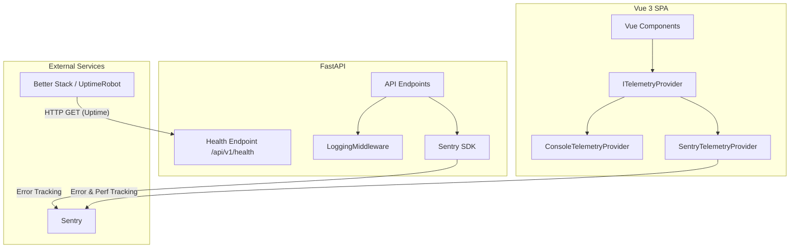

# Monitoring & Observability Architecture

This document describes the telemetry and monitoring setup used in the Enterprise Analytics Platform. The architecture provides error tracking, performance monitoring, and system health checks.

## Architecture Diagram

## Frontend Telemetry
The frontend abstracts telemetry via `ITelemetryProvider`.
- **Development:** `ConsoleTelemetryProvider` logs events to the browser console.
- **Production:** `SentryTelemetryProvider` automatically handles unhandled rejections, Vue errors, and captures custom metrics like `upload_duration_ms` and `dashboard_render_duration_ms`.
- **Graceful Degradation:** If `VITE_SENTRY_DSN` is not provided, the app continues to function seamlessly, falling back or bypassing Sentry.

## Backend Telemetry
The backend leverages Python's `sentry-sdk`.
- **Sentry Integration:** Captures unhandled exceptions globally during the FastAPI application lifespan. Activated dynamically based on `SENTRY_DSN`.
- **Structured Logging:** Uses `loguru`. Every incoming request is decorated with an `X-Request-ID` and `X-Correlation-ID`. The correlation ID flows downstream to allow tracking requests across microservice boundaries.
- **Enterprise Healthchecks:** The `/api/v1/health` endpoint returns exact `uptime`, real-time system `memory` (via `psutil`), and sub-system connection status for availability monitoring (Better Stack, Datadog).
