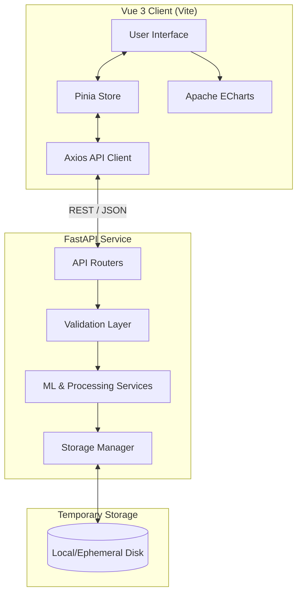

# Enterprise Analytics Platform - Architecture Design

## 1. Product Requirements Document (PRD)
**Product Name:** Enterprise Analytics Platform  
**Vision:** To provide business users with a scalable, automated, and intuitive platform to transform raw CSV datasets into actionable business insights through automated Machine Learning (clustering) without requiring deep data science expertise.  
**Target Audience:** Data Analysts, Business Intelligence Professionals, and Product Managers.  
**Core Value Proposition:** Seamless, zero-configuration data profiling, cleaning, and clustering via a modern web interface.

---

## 2. Functional Requirements
- **CSV Upload:** System shall accept UTF-8 encoded, comma-separated CSV files up to a configurable maximum size.
- **Validation:** System shall validate file extension, MIME type, emptiness, headers (no duplicates), column count (min 2 numeric), and invalid characters.
- **Profiling:** System shall automatically generate dataset statistics including dimensions, column types, missing values, duplicates, and descriptive statistics (Mean, Median, Std, Min, Max, Percentiles).
- **Cleaning:** System shall automatically handle duplicates, impute missing values (median for numeric, mode for categorical, forward fill for datetime), cast types, and strip whitespace.
- **Scaling:** System shall apply `RobustScaler` if outliers are detected, otherwise `StandardScaler`.
- **Elbow Detection & Clustering:** System shall identify optimal clusters (K between 2-15) using the KneeLocator algorithm and apply `MiniBatchKMeans`.
- **Summary Generation:** System shall output cluster sizes, feature averages, top categories, and business interpretation hints.
- **Dashboard Visualization:** System shall display Dataset Summary, Cleaning Summary, Cluster Distribution, Elbow Chart, PCA Scatter Plot, Cluster Summary Table, and provide category filters.

---

## 3. Non-Functional Requirements
- **Performance:** End-to-end processing of a standard dataset should be highly optimized and fast.
- **Scalability:** The backend must be stateless (except for temporary storage) to allow horizontal scaling.
- **Usability:** The UI must be responsive, modern, and accessible, requiring zero prior configuration for clustering.
- **Reliability:** The system must handle corrupted or malformed CSV files gracefully with friendly error messages.
- **Security:** No authentication for MVP, but inputs must be strictly sanitized to prevent injection.
- **Data Privacy:** All uploaded datasets and intermediate files must be automatically deleted after 1 hour.

---

## 4. Architecture Diagram



---

## 5. Folder Structure
```text
enterprise-analytics-platform/
├── frontend/                 # Vue 3 UI Application
│   ├── public/
│   ├── src/
│   │   ├── assets/           # Static assets, Tailwind CSS config
│   │   ├── components/       # Reusable UI components
│   │   ├── composables/      # Vue composables
│   │   ├── layouts/          # Page layouts
│   │   ├── pages/            # View components (Upload, Dashboard)
│   │   ├── services/         # Axios API clients
│   │   ├── store/            # Pinia state management
│   │   ├── types/            # TypeScript interfaces
│   │   ├── utils/            # Helper functions
│   │   ├── App.vue
│   │   └── main.ts
│   ├── index.html
│   ├── package.json
│   ├── tailwind.config.js
│   ├── tsconfig.json
│   └── vite.config.ts
├── backend/                  # FastAPI Application
│   ├── app/
│   │   ├── api/              # Routers and endpoints
│   │   │   ├── dependencies/ # Dependency injection
│   │   │   └── routes/
│   │   ├── core/             # Config, exceptions, logging (Loguru)
│   │   ├── models/           # Pydantic v2 schemas (Domain/API)
│   │   ├── services/         # Business logic (ML, Profiling, Cleaning)
│   │   ├── utils/            # Helper utilities
│   │   └── main.py           # Application entrypoint
│   ├── data/                 # Temporary storage directory (git ignored)
│   ├── tests/                # Pytest unit and integration tests
│   ├── pyproject.toml        # Poetry/Pip dependencies
│   └── requirements.txt
├── shared/                   # Shared types, schemas, or constants
├── docker/                   # Dockerfiles and Compose configs
│   ├── frontend.Dockerfile
│   ├── backend.Dockerfile
│   └── docker-compose.yml
├── docs/                     # Architecture, API docs, Runbooks
├── scripts/                  # CI/CD and utility scripts (e.g., cleanup job)
└── README.md
```

---

## 6. Backend Architecture
The backend follows **Clean Architecture** principles:
- **API/Router Layer:** Handles HTTP requests and formatting responses using standardized schemas.
- **Service Layer:** Contains the core business logic (`ProfilingService`, `CleaningService`, `MLService`). Keeps the controllers lightweight.
- **Repository/Storage Layer:** Abstracts file I/O operations and directory lifecycle management.
- **Dependencies:** Uses FastAPI's `Depends` for injecting services, ensuring loose coupling and easy testing.
- **Stack:**
  - `FastAPI` + `Pydantic v2`: Routing and validation.
  - `Pandas` + `NumPy`: Data manipulation.
  - `Scikit-Learn`: Scaling, PCA, MiniBatchKMeans.
  - `kneed`: Elbow detection.
  - `SciPy`: Statistical operations.
  - `Loguru`: Structured logging at every pipeline stage.

---

## 7. Frontend Architecture
- **Framework:** Vue 3 with Composition API and `<script setup>` syntax built on Vite.
- **State Management:** Pinia, divided into domain modules (e.g., `uploadStore`, `dashboardStore`).
- **Routing:** Vue Router for navigating between Upload, Loading, and Dashboard views.
- **Styling:** Tailwind CSS for rapid, responsive, and consistent UI design.
- **Visualization:** Apache ECharts mapped to Vue components for high-performance interactive charts (Elbow, PCA Scatter, distributions).
- **HTTP Client:** Axios with global interceptors for centralized error handling and standard response parsing.

---

## 8. Data Flow
1. **Upload:** User uploads CSV -> Frontend sends `multipart/form-data` -> Backend Validator checks file -> Saves with UUID -> Returns UUID.
2. **Processing Request:** Frontend requests `/analysis/{uuid}` -> Backend loads CSV.
3. **Profiling:** Backend computes statistics -> Generates Profile summary.
4. **Cleaning:** Backend applies missing value/duplicate strategies -> Saves cleaned data in memory/disk.
5. **ML Pipeline:** Cleaned Data -> Scaling (Robust or Standard) -> PCA -> KneeLocator (K: 2 to 15) -> MiniBatchKMeans -> Extracts Summaries.
6. **Result Delivery:** Backend aggregates ML results -> Frontend fetches via Dashboard API endpoints.
7. **Cleanup:** Background script/task purges files older than 1 hour.

---

## 9. API Design
RESTful principles applied. Every endpoint returns a standardized envelope wrapper:
```json
{
  "success": true,
  "message": "Operation successful",
  "data": { ... },
  "error": null,
  "timestamp": "2026-06-26T23:21:00Z",
  "request_id": "req-12345"
}
```
**Core Endpoints:**
- `GET /health` - System health check.
- `POST /upload` - Accepts CSV file. Returns `dataset_id` (UUID).
- `GET /analysis/{id}` - Triggers full pipeline (or checks status if async).
- `GET /profiling/{id}` - Returns dataset statistics, schema, and missing values.
- `GET /summary/{id}` - Returns high-level metrics and elbow K results.
- `GET /clusters/{id}` - Returns cluster sizes, averages, and business interpretations.
- `GET /dashboard/{id}` - Aggregated endpoint returning all necessary data for UI rendering.

---

## 10. Database/Storage Design
- **Storage Medium:** Local ephemeral disk (or mapped Docker volume). No SQL/NoSQL database for the MVP.
- **Structure:**
  - `/data/{uuid}/raw.csv`
  - `/data/{uuid}/cleaned.csv`
  - `/data/{uuid}/metadata.json`
- **Retention Strategy:** A background thread or OS-level Cron job scans the `/data` directory and deletes folders where `creation_time < (now - 1 hour)`.

---

## 11. Docker Architecture
- **Network:** Isolated bridge network `analytics-net`.
- **Backend Container:** Python 3.11 slim, exposes port 8000. Uses Uvicorn with Gunicorn for worker management. Mounts `/data` volume.
- **Frontend Container:** Multi-stage build. Node.js for Vite build, Nginx for serving static files on port 80.
- **Docker Compose:** Manages both services, ports, and the shared network for single-command startup.

---

## 12. Deployment Architecture
- **Infrastructure (MVP):** Single cloud VM instance (e.g., AWS EC2, GCP Compute Engine, DigitalOcean Droplet).
- **Reverse Proxy:** Nginx or Traefik handling TLS/SSL termination and routing:
  - `/api/*` -> Backend Container
  - `/` -> Frontend Container
- **CI/CD:** GitHub Actions to lint, test, build Docker images, and trigger remote deployment via SSH.

---

## 13. Development Roadmap
- **Week 1 (Foundation):** Repository setup, Dockerization. Build API foundation, Validation layer, and Storage manager.
- **Week 2 (Data Engineering & ML):** Implement Profiling, Cleaning, Scaling, Elbow Detection, and MiniBatchKMeans services.
- **Week 3 (Frontend Base):** Setup Vue 3 project, Tailwind styling, Pinia state, and CSV Upload UI with validation.
- **Week 4 (Dashboard & Polish):** Integrate Apache ECharts for Dashboard. Connect Frontend to Backend APIs. End-to-end testing, error handling polish, and logging verification.

---

## 14. Coding Standards
- **Backend (Python):** PEP-8 enforced via `ruff` and `black`. Strict type hinting checked via `mypy`. Dependency Injection required. Docstrings for all services.
- **Frontend (Vue/TS):** Vue Style Guide conventions. Strict TypeScript (`tsconfig` strict mode). Formatted via Prettier + ESLint.
- **Version Control:** Conventional Commits (`feat:`, `fix:`, `refactor:`). Pull Request reviews required before merging to main.

---

## 15. Definition of Done
- All features in the PRD are fully implemented.
- Standardized API response format is strictly followed.
- Error handling gracefully processes bad inputs without crashing.
- Unit tests written and passing (Backend coverage > 80%).
- Logging (via Loguru) captures all major pipeline steps (Upload, Validation, Cleaning, Scaling, Clustering, Summary, Error).
- E2E flow (Upload to Dashboard) is functional.
- Temporary files are proven to auto-delete after 1 hour.

---

## 16. Future Roadmap (Phase 2 and Production)
- **Phase 2 (Enhancements):**
  - Chunking/Streaming to support massive datasets (Dask or Polars).
  - Configurable UI to allow users to tweak ML parameters.
  - Export capabilities (Download PDF report, Export CSV with cluster labels attached).
- **Production Scale:**
  - Move to Kubernetes for auto-scaling worker nodes.
  - Implement Celery/Redis for asynchronous task processing with WebSocket progress updates to the frontend.
  - User Authentication (OAuth2) and persistent storage (PostgreSQL for metadata, AWS S3/GCS for datasets).

Phase 4 → Frontend Dashboard (Vue 3 + Tailwind + ECharts)
Phase 4.4 (Dashboard & ECharts Integration)
Phase 5 → Integration, Testing, Quality Assurance, Performance
Phase 6 → Production Deployment, CI/CD, Monitoring, Documentation
